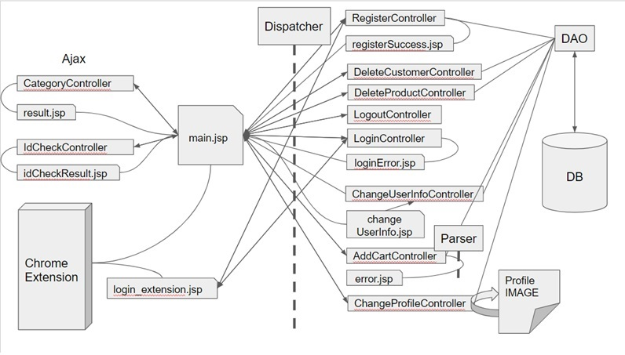

# LAZY-CART

> LazyCart (레이지카트)는   *  <b>소비자중심 "YongHunDotCom-licensed 오픈소스 웹-서비스"</b>입니다.  *  LazyCart는 전적으로 감사하는 후원자님들과 테크니컬-파트너분들의 지속적인 참여를 통해 운영되는 서비스입니다.

### LazyCart는 우리 모두의 참여로 발전해나가는 공동체입니다. 함께 하세요 :)

<ul>
	<li><a href="mailto:beanskobe@gmail.com">후원을 통한 참여</a></li>
	<li><a href="mailto:beanskobe@gmail.com">기술적 참여</a></li>
</ul>

## Table of contents

* [서비스 설명](#서비스-설명)
* [시연](#시연)
* [컨셉트](#컨셉트)
* [요구사항분석](#요구사항분석)
* [데이터베이스](#데이터베이스)
* [프로젝트 구조와 패턴](#서비스-구조와-패턴)
* [인터페이스와 기능](#인터페이스와-기능)
* [팀워크플로우](#팀워크)
* [팀소개](#팀소개)

## 서비스 설명 : "쇼핑몰 통합 장바구니 서비스"
 
### 1. 주제 소개 
- 여러 쇼핑몰에서 살펴본 상품들의 정보를 하나의 장바구니에 담아 상품을 조회, 비교, 구매할 수 있는 프로그램입니다.  
- 기존에는 장바구니 기능은 개별 홈페이지의 상품만 담을 수 있는 반면, LazyCart는 쇼핑몰 페이지 도메인과 무관하게 상품을 담을 수 있어 유저가 보다 편리하게 온라인 쇼핑할 수 있습니다.

### 2. 컨셉 
EasyBasket은 "편리한 온라인 쇼핑을 돕는 장바구니 프로그램"로써...
- 기능적인 측면에서 Chrome Extension을 사용하여 현재 상품 페이지 탭에서 탭 이동 없이 장바구니를 사용할 수 있습니다. 
- 화면 구성 또한 단순한 구성과 색상으로 Assistance Program으로써 기능적인 면에 보다 충실하고자 합니다. 구글 쇼핑 UI를 참고했습니다. 
 

### Dependencies

| 라이브러리 | 경로 | 버전| 용도|
|---------|--------|-------|-------------|
| Apache Tomcat | 로컬 | 8.5(Runtime)/3.1(Servlet) | 웹 프레임워크 |
|Java EE | 로컬| 8 | 서버사이드 랭귀지 / DB커넥션 |
|MySQL | 로컬 | 8.0 | 데이터베이스 |
|Eclipse Photon | 개인 | 4.8 | 통합 IDE |
| Jsoup  | .jar | 1.13.1 | Java HTML Parser |
| JSTL/Standard  | .jar | 1.2/1.2.3.| JSP 표준 태그 라이브러리 |
| Commons-io  | .jar | 2.7 | 파일업로드 |
| Commons-Fileload  | .jar | 1.4 | 파일업로드 |
| Jquery  | CDN | 3.5.1 / 1.12.4 / 1.12.1 | JavaScript Library |
| (구글) analytics.js  | CDN | 1.2.1 | 웹분석서비스 |
| Chart.js  | CDN | 2.7.1 / 2.9.3 | 차트 |
| Util.js  | CDN | 1 | JavaScript Library |
| (다음) postcode.js  | CDN | 2 | 회원가입 주소검색 |
| popper.js  | CDN | 1.16.0 | 차트 말풍선 |
| Bootstrap  | CDN | 4.5.0 | CSS-프레임워크 |

## User-centric 유저 중심의 기능 분석

익스텐션과 웹은 공통된 기능 및 화면을 사용하면서도 각각 특징에 맞는 기능과 UI를 나눠서 구상했습니다. 
- Chrome Extension은 장바구니 담기와 상품 조회 목적에 최소화하며 화면 또한 단순화하여 쇼핑에 집중할 수 있도록 합니다. 
웹은 필터링/검색/Analysis 등 추가적 기능을 포함하며 특히, 장바구니 상품을 가격, 쇼핑몰, 카테고리 등 기준으로 비교할 수 있습니다. 

- 프로토타입 및 유저 중심의 기능 분석
 
 

## 서비스 패턴	
### 패턴 (다이어그램) 
 
 

## 데이터베이스
데이터베이스는 유저(customer)와 상품 정보(product) 엔터티가 다:다 관계로, 각각 장바구니(cart) 엔터티와의 1:다 관계로 설정합니다. 
 

## 주요 기능 소개
### 1. 기본 기능
Lazybasket에서 기본 기능은 User, Product,Cart CRUD controller & ajax 관련 기능입니다.
  

### 2. Crawling 
- Jsoup라이브러리 활용하여 쇼핑몰 url을 수집.
- 쇼핑몰마다 HTML 구조가 다르게 셋팅되어 있어 각각에 맞는 Parser Controller 구현, Parser만 분류하는 Parser Handler를 별도로 작성. 
  

### 3. 정렬/필터 기능 
#### 3-1) 상품명으로 Cart 정렬(default) 
  

#### 3-2) 카테고리 필터링 
  

#### 3-3) 가격 필터링  
<필터링 전>  
  

<필터링 후>  
  

### 4. Chrome Extension 
  
#### 4-1) 파일 정보 
- manifest.json 
: Chrome Extension의 기본적인 정보를 등록합니다다. (이름, 아이콘, 기본 팝업창, background script, content script, 어떤 사이트에서 스크립트가 사용될지 등.)   
- background.js 
: Chrome Extension 전반에서 이벤트 발생시 특정한 기능을 처리합니다. 페이지 이동, 익스텐션 설치, 텝 닫힘 등을 감지합니다. Lazybasket Extension에서는 메시지 리스너를 추가해 콘텐츠 스크립트에서 전달된 메세지에 따라 로그인 배너를 아이콘 위에 표시하도록 합니다.  
- content.js 
 : manifest 파일에 content.js가 페이지가 http://localhost:8888/에 포함된 경우 호출되도록 match한다. 현재 크롬익스텐션은 모두 iframe 기반으로, 서버에서 받은 데이터를 iframe 내부에 호출합니다.  웹 보안 정책인 same origin policy는 불러온 스크립트가 호스트가 다른 경우, 보안을 위해 접근을 제한합니다. 따라서 content.js가 iframe 내부에서 호출되어 데이터를 받아오는 작업이 필수적입니다.  본 프로그램에서 content.js는 background script와 iframe을 호출하는 모든 페이지와 메세지를 주고받습니다. content.js는 로그인 여부, 작업 성공 여부를 검사합니다.  
- 기타 html 확장자 
 : 모든 html파일은 별개로 각자의 js파일을 가집니다. js파일에는 기본적인 javascript 함수들과 chrome.extension API 기능을 사용한 함수를 등록합니다.  

#### 4-2) 동작 순서 
(1) content script 가 로그인 여부를 검사합니다. 사이트에 접속하거나 익스텐션 아이콘을 누르면 호출됩니다.  
   
(2) background script가 content script에서 전달된 메세지를 받습니다. 배너가 로그인 여부에 따라 ON/OFF로 바뀝니다. 
(3) popup.html이 content script에서 전달된 메세지를 받습니다. 로그인 여부에 따라 메뉴가 로그인/로그아웃으로 바뀝니다.  
   
(4) popup.html에 메뉴를 클릭하면 각각의 기능이 동작합니다. iframe이 호출된 경우, 정보는 모두 서버로 전달되고 저장됩니다.  
  

### 5. Analysis  
- Chart.JS 활용
- 쇼핑몰별 상품비율을 나타내는 도넛 그래프, 쇼핑몰별 상품의 평균 가격대 비교하는 히스토그램.
- SessionAttribute에 저장된 ProductList를 SJTL을 활용하여 데이터로 사용. 
 
	
## 협업방식
### 1. 업무 일지,
  - 팀원끼리 번갈아가며 업무일지 회의록 작성함으로써 팀원 모두 업무 현황을 공유.
  - 매일 회의에서 팀 및 개인적 차원에서 오늘/내일 할 일들을 정리.
### 2. 간트차트
간트차트로 업무 진척도 파악. 

### 3. Slack
  - 메신저 
  - 깃헙 프로젝트 저장소 구독 (Repository Subscription) 

### 4. Version Control System (Github)
1. 각자 편한 Github 프로그램 사용  
	1.1. master pull > new branch > work > pull request  
	1.2. master pull > work > updated master pull & merge > test > push master  

 

## 팀소개

| Lee, Chi Jong | Im, Chae Eun | Cho, Yong Hun | Kim, Joo Hyuk |
| :---: | :---: | :---: | :---: |
| Seoul,Korea | Theater,Cafe,Gallery | Seoul,Korea | Jeju, Philppines, Seoul |
| Project Leader | Full-ops Manager | Dev-ops Manager | Developing Surfer | 
|||||
|    |    |    |    |
